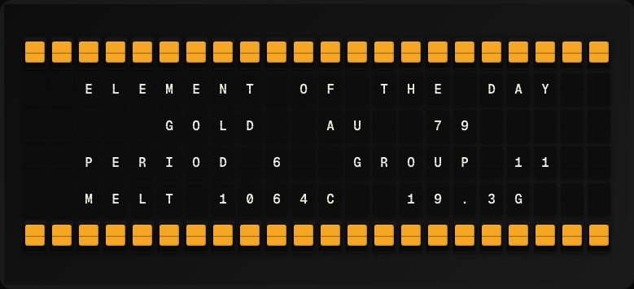

# Element of the Day Plugin

Display a periodic table element that changes daily.



**→ [Setup Guide](./docs/SETUP.md)**

## Overview

The Element of the Day plugin selects a periodic table element based on the day of the year (day_of_year mod 118), cycling through all 118 elements. It fetches element details from the PubChem REST API. No API key required.

## Template Variables

| Variable | Description | Example |
|---|---|---|
| `element_of_day.element_name` | Element name | `Hydrogen` |
| `element_of_day.symbol` | Element symbol | `H` |
| `element_of_day.atomic_number` | Atomic number | `1` |
| `element_of_day.atomic_weight` | Standard atomic weight | `1.008` |
| `element_of_day.category` | Element category (e.g. nonmetal, noble gas) | `nonmetal` |

## Example Templates

```
ELEMENT OF THE DAY
{{element_of_day.element_name}}
Symbol: {{element_of_day.symbol}}
# {{element_of_day.atomic_number}}
Weight: {{element_of_day.atomic_weight}}
{{element_of_day.category}}
```

## Configuration

| Setting | Name | Description | Required |
|---|---|---|---|
| `refresh_seconds` | Refresh Interval | How often to fetch data (seconds) | No |

## Features

- Cycles through all 118 elements
- PubChem REST API (no API key)
- Atomic number, weight, category
- New element every day

## Author

FiestaBoard Team
